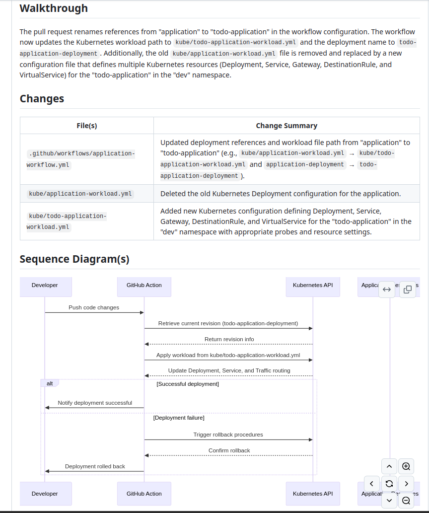
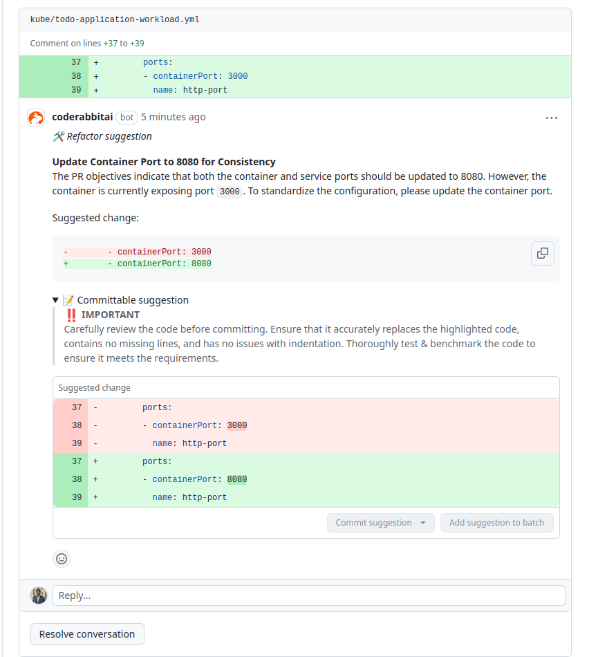

# EKS Infrastructure Project

A comprehensive Infrastructure as Code (IaC) project for deploying and managing an AWS EKS cluster with integrated monitoring, logging, tracing, and service mesh capabilities.

## Directory Structure

```
assessment/
├── .github/
│   └── workflows/              # CI/CD Pipeline configurations
│       ├── [infrastructure-workflow.yml](/.github/workflows/infrastructure-workflow.yml)
│       └── docs/              # Pipeline documentation
├── app/                       # Application source code
│   ├── src/                  # Application source files
│   ├── spec/                 # Test specifications
│   ├── Dockerfile           # Optimized container configuration
│   └── package.json         # Node.js dependencies
├── docs/
│   └── workflows/             # Detailed workflow documentation
│       ├── infrastructure/    # Infrastructure pipeline docs
│       └── application/       # Application pipeline docs
├── iac/                       # Infrastructure as Code
│   ├── [README.md](/iac/README.md)  # IaC documentation
│   ├── modules/              # Terraform modules
│   │   ├── vpc/             # VPC configuration
│   │   └── eks/             # EKS and controllers
│   ├── main.tf              # Main Terraform configuration
│   └── variables.tf         # Input variables
└── [LICENSE](/LICENSE)       # Project license
```

## Directory Descriptions

### [Infrastructure as Code (iac)](/iac)
The `iac` directory contains all Terraform configurations for our AWS infrastructure. See [iac/README.md](/iac/README.md) for detailed documentation.

- **Purpose**: Manages cloud infrastructure using Terraform
- **Key Components**:
  - EKS Cluster (v1.27)
  - VPC with public/private subnets
  - Monitoring stack (Grafana, Prometheus, Loki, Tempo)
  - Service mesh (Istio, Kiali)
- **Documentation**: Comprehensive guide for infrastructure deployment and management

### [Application (app)](/app)
The `app` directory contains the Node.js application code that will be deployed to our EKS cluster.

- **Purpose**: Sample application for deployment
- **Key Components**:
  - Express.js REST API
  - SQLite database
  - Unit tests
  - Multi-stage Dockerfile
- **Features**:
  - Optimized container build
  - Health checks
  - Graceful shutdown
  - Security hardening

### [GitHub Workflows (.github/workflows)](/.github/workflows)
CI/CD pipeline configurations and automation scripts. See [infrastructure-workflow.yml](/.github/workflows/infrastructure-workflow.yml) for the main pipeline.

- **Purpose**: Automates infrastructure deployment and testing
- **Key Features**:
  - AWS authentication via OIDC
  - Terraform automation
  - Security checks
  - State management
- **Documentation**: Pipeline setup and configuration guides

### [Documentation (docs)](/docs)
Comprehensive project documentation organized by component.

- **Purpose**: Central knowledge repository
- **Key Sections**:
  - [Infrastructure Workflows](/docs/workflows/infrastructure): Infrastructure pipeline documentation
  - [Application Workflows](/docs/workflows/application): Application deployment guides
  - Architecture diagrams
  - Security policies
  - Best practices
- **Usage**: Reference for development and operations teams

## Branching Strategy

### Main Branches
- `main` (default): Production-ready code
- `dev`: Development and integration
- `staging`: Pre-production testing

### Feature Branches
Format: `feature/<issue-number>-<brief-description>`
Example: `feature/123-add-grafana-dashboards`

### Hotfix Branches
Format: `hotfix/<issue-number>-<brief-description>`
Example: `hotfix/456-fix-prometheus-config`

### Release Branches
Format: `release/v<major>.<minor>.<patch>`
Example: `release/v1.2.0`

## Commit Message Convention

We follow the [Conventional Commits](https://www.conventionalcommits.org/) specification:

```
<type>(<scope>): <description>

[optional body]

[optional footer(s)]
```

### Types
- `feat`: New feature
- `fix`: Bug fix
- `docs`: Documentation
- `chore`: Maintenance
- `refactor`: Code restructuring
- `test`: Adding tests
- `ci`: CI/CD changes

### Examples
```bash
feat(monitoring): add custom Grafana dashboards
fix(eks): correct node group scaling configuration
docs(readme): update deployment instructions
```

## Pull Request Guidelines

### PR Template
- Title: Follow commit message convention
- Description: Include purpose, changes, and testing done
- Reference: Link related issues

### Requirements
1. **Code Review**
   - Minimum 2 approvals required
   - Must pass all CI checks
   - No merge conflicts

2. **Documentation**
   - Update relevant documentation
   - Include configuration changes
   - Add comments for complex logic

3. **Testing**
   - Include test results
   - Add new tests for features
   - Update existing tests

### Review Process
1. Code quality check
2. Architecture review
3. Security assessment
4. Documentation review

## AI Integration

### Automated Code Review

This repository uses [CodeRabbit AI](https://www.coderabbit.ai/) for automated code reviews, ensuring code quality even in self-maintained projects. CodeRabbit AI provides comprehensive code analysis and suggestions for improvements.

#### Features

- Automated code quality assessment
- Security vulnerability detection
- Performance optimization suggestions
- Style and best practices enforcement
- Documentation completeness checks
- Inline code suggestions with commit-ready improvements

#### Example Reviews

Here are examples of CodeRabbit AI in action:

1. **Pull Request Summary**  
   CodeRabbit AI provides a comprehensive summary of changes and their impact:
   

2. **Inline Code Suggestions**  
   Detailed code improvements with ready-to-commit suggestions:
   

#### Best Practices

1. Always review AI suggestions before implementing
2. Pay special attention to security-related recommendations
3. Use AI suggestions as learning opportunities to improve code quality
4. Consider implementing suggested improvements promptly for better code maintainability

For more information about CodeRabbit AI configuration and features, visit their [official documentation](https://www.coderabbit.ai/docs).

## Getting Started

1. Clone the repository
   ```bash
   git clone https://github.com/yourusername/assessment.git
   ```

2. Set up development environment
   ```bash
   cd assessment
   # Install required tools
   make setup
   ```

3. Create new feature branch
   ```bash
   git checkout -b feature/123-new-feature
   ```

4. Make changes and commit
   ```bash
   git commit -m "feat(scope): description"
   ```

5. Push changes and create PR
   ```bash
   git push origin feature/123-new-feature
   ```

## License

This project is licensed under the MIT License - see the [LICENSE](/LICENSE) file for details.

## Contributing

1. Fork the repository
2. Create your feature branch
3. Commit your changes
4. Push to the branch
5. Create a Pull Request

## Support

For support and questions:
- Create an issue
- Contact DevOps team
- Check documentation