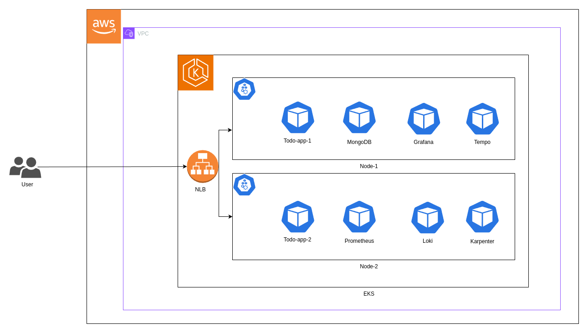

# Architecture Overview

This document describes the cloud-native architecture of our Todo application deployed on AWS using Kubernetes (EKS).

## System Architecture Diagram

## Components Overview

### 1. AWS Infrastructure
- **VPC (Virtual Private Cloud)**
  - Isolated network environment
  - Multiple availability zones for high availability
  - Public and private subnets

### 2. Amazon EKS (Elastic Kubernetes Service)
- **Network Load Balancer (NLB)**
  - Entry point for all traffic
  - Distributes traffic across nodes

- **Node Groups**
  1. **Node-1**: Primary application workloads
     - Todo-app-1 (Application instance)
     - MongoDB (Database)
     - Grafana (Monitoring UI)
     - Tempo (Distributed tracing)

  2. **Node-2**: Monitoring and scaling
     - Todo-app-2 (Application instance)
     - Prometheus (Metrics collection)
     - Loki (Log aggregation)
     - Karpenter (Node autoscaling)

### 3. Application Components

#### Core Services
- **Todo Application**
  - Replicated across nodes (Todo-app-1 and Todo-app-2)
  - Stateless application design
  - Load balanced for high availability

#### Database
- **MongoDB**
  - Primary database for Todo application
  - Persistent storage for task data
  - Deployed on Node-1

#### Observability Stack
1. **Metrics**
   - Prometheus for metrics collection
   - Grafana for visualization
   - Custom dashboards for monitoring

2. **Logging**
   - Loki for log aggregation
   - Centralized logging solution
   - Log retention and search capabilities

3. **Tracing**
   - Tempo for distributed tracing
   - End-to-end request tracking
   - Performance monitoring

#### Infrastructure Management
- **Karpenter**
  - Automatic node provisioning
  - Workload-aware scaling
  - Cost optimization

## Key Features

1. **High Availability**
   - Multiple availability zones
   - Replicated application instances
   - Load balancing across nodes

2. **Scalability**
   - Horizontal pod autoscaling
   - Automated node scaling with Karpenter
   - Distributed architecture

3. **Observability**
   - Complete monitoring stack
   - Real-time metrics and logging
   - Distributed tracing
   - Custom Grafana dashboards

4. **Security**
   - VPC isolation
   - Network segmentation
   - AWS security groups
   - Kubernetes RBAC

## Network Flow

1. User requests reach the Network Load Balancer
2. NLB distributes traffic to application pods
3. Application pods process requests and interact with MongoDB
4. Observability components collect metrics, logs, and traces

## Deployment Strategy

- Infrastructure as Code using Terraform
- GitOps workflow for deployments
- Automated scaling based on demand
- Rolling updates for zero-downtime deployments

## References

1. [AWS EKS Documentation](https://docs.aws.amazon.com/eks/latest/userguide/what-is-eks.html)
2. [Kubernetes Documentation](https://kubernetes.io/docs/home/)
3. [Architecture Diagram](../static-resources/architecture-diagram.png)
4. [Infrastructure Code](../iac/README.md)
5. [Monitoring Stack Documentation](../monitoring/README.md)