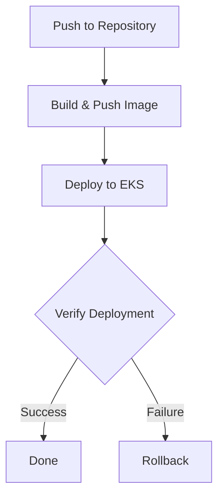

# Application CI/CD Pipeline

This document details the CI/CD pipeline for the application deployment process.

## Pipeline Overview



## Trigger Events

- Push to `main` branch
- Push to `feature/*` branches
- Push to `fix/*` branches
- Manual trigger via `workflow_dispatch`

### Path Filters
Only triggers on changes to:
- `app/**`
- `kube/todo-application-workload.yml`
- `.github/workflows/application-workflow.yml`

## Environment Variables

| Variable | Description | Source |
|----------|-------------|---------|
| DOCKERHUB_USERNAME | Docker Hub username | GitHub Secret |
| AWS_REGION | AWS region (ap-southeast-1) | Hardcoded |
| EKS_CLUSTER_NAME | EKS cluster name | Hardcoded |
| IMAGE_NAME | Docker image name | Computed |
| IMAGE_TAG | Git SHA | GitHub Context |

## Pipeline Jobs

### 1. Build and Push (build-and-push)

**Purpose**: Build and publish Docker image to Docker Hub

**Steps**:
1. Checkout code
2. Setup Docker Buildx
3. Login to DockerHub
4. Build and push image with tags:
   - `latest`
   - Git SHA-based tag

**Features**:
- Uses Docker layer caching
- Multi-platform build support
- Secure credential handling

### 2. Deploy (deploy)

**Purpose**: Deploy application to EKS cluster

**Dependencies**:
- Requires successful build-and-push job
- AWS credentials
- EKS cluster access

**Steps**:
1. Configure AWS credentials using OIDC
2. Update kubeconfig
3. Deploy to EKS:
   - Create MongoDB secrets
   - Apply application workload
4. Verify deployment
5. Automatic rollback on failure

## Security Features

1. **Permission Management**
   - Minimal repository permissions
   - OIDC authentication for AWS
   - Secure secret handling

2. **Credential Handling**
   - No plaintext credentials
   - Short-lived AWS credentials
   - Docker Hub token-based auth

## Deployment Verification

The pipeline includes robust deployment verification:
```bash
kubectl rollout status deployment/todo-application-deployment -n dev --timeout=180s
```

## Rollback Mechanism

Automatic rollback triggers if:
- Deployment verification fails
- Timeout occurs (180s)

Rollback process:
1. Captures current revision
2. Executes rollback command
3. Verifies rollback success

## Monitoring and Logging

- Deployment status tracking
- Rollback status logging
- Secret verification
- Container health checks

## Best Practices

1. **Image Management**
   - Unique SHA-based tags
   - Latest tag updates
   - Layer caching for speed

2. **Deployment Safety**
   - Automatic rollbacks
   - Timeout limits
   - Health checks

3. **Security**
   - OIDC authentication
   - Minimal permissions
   - Secure secret handling