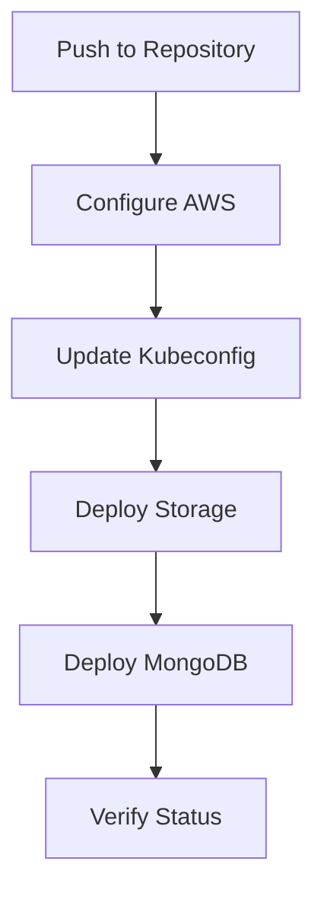

# Data Persistence Pipeline

This document details the pipeline for managing MongoDB StatefulSet deployment and storage configuration.

## Pipeline Overview



## Trigger Events

Currently configured for:
- Manual trigger via `workflow_dispatch`
- (Commented out) Push triggers for:
  - `main` branch
  - `feature/*` branches
  - `fix/*` branches

### Path Filters
Only triggers on changes to:
- `.github/workflows/data-persistence-pipeline.yml`
- `kube/storage-class.yml`
- `kube/mongodb-statefulset.yml`

## Environment Configuration

### Permissions
- `contents: read`: Read repository contents
- `id-token: write`: OIDC token management

### Variables
- `EKS_CLUSTER_NAME`: infra-practice-dev

## Pipeline Jobs

### Deploy Database Infrastructure

**Purpose**: Set up and configure MongoDB with persistent storage

#### Steps:

1. **AWS Configuration**
   ```bash
   # OIDC-based authentication
   # Role assumption: github-actions-role
   ```

2. **EKS Access Setup**
   ```bash
   aws eks update-kubeconfig --name ${EKS_CLUSTER_NAME}
   ```

3. **Storage Class Deployment**
   ```bash
   kubectl apply -f kube/storage-class.yml
   kubectl get storageclass/ebs-sc
   ```

4. **MongoDB Deployment**
   ```bash
   # Set credentials
   export MONGODB_USERNAME=${{ secrets.MONGODB_USERNAME }}
   export MONGODB_PASSWORD=${{ secrets.MONGODB_PASSWORD }}
   
   # Deploy with variable substitution
   cat kube/mongodb-statefulset.yml | envsubst | kubectl apply -f -
   ```

5. **Deployment Verification**
   ```bash
   # Wait for pod readiness
   kubectl -n dev wait --for=condition=Ready pod/mongodb-0 --timeout=300s
   
   # Verify resources
   kubectl -n dev get pods -l app=mongodb
   kubectl -n dev get pvc -l app=mongodb
   ```

## Security Features

1. **Authentication**
   - OIDC-based AWS authentication
   - Secure secret handling
   - Role-based access

2. **Credential Management**
   - MongoDB credentials in secrets
   - AWS role-based access
   - No plaintext credentials

## Storage Configuration

### EBS Storage Class
- Provisioner: EBS
- Volume type: gp3
- Reclaim policy: Retain

### Persistent Volume Claims
- Dynamic provisioning
- ReadWriteOnce access mode
- Retention policy enabled

## Monitoring and Verification

1. **Resource Checks**
   - Pod status monitoring
   - PVC verification
   - Storage class validation

2. **Health Verification**
   - Pod readiness probe
   - Timeout handling (300s)
   - Resource labeling

## Best Practices

1. **Storage Management**
   - Persistent data handling
   - Volume retention
   - Backup considerations

2. **Deployment Safety**
   - Resource verification
   - Timeout limits
   - Status checking

3. **Security**
   - OIDC authentication
   - Secret management
   - Minimal permissions

## Troubleshooting

### Common Issues
1. Storage Class Issues
   - Check AWS EBS CSI driver
   - Verify IAM permissions
   - Check storage class parameters

2. MongoDB StatefulSet Problems
   - Check pod logs
   - Verify PVC binding
   - Check secret mounting

### Resolution Steps
1. Storage Issues
   ```bash
   kubectl describe sc ebs-sc
   kubectl describe pvc
   ```

2. MongoDB Issues
   ```bash
   kubectl logs -n dev mongodb-0
   kubectl describe statefulset mongodb -n dev
   ```
