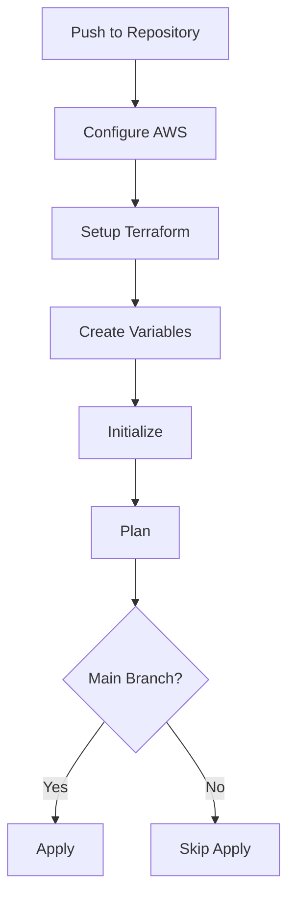

# Infrastructure CI/CD Pipeline Documentation

## Overview

This document describes the Infrastructure CI/CD Pipeline implemented using GitHub Actions. The pipeline automates the deployment and management of our AWS EKS infrastructure using Terraform.

## Pipeline Location
```
.github/workflows/infrastructure-workflow.yml
```

## Pipeline Triggers

- **Push to dev branch**: Automatically triggers the pipeline
- **Manual trigger**: Available through GitHub Actions UI using `workflow_dispatch`

## AWS Authentication & Security

### OIDC Integration
The pipeline uses OpenID Connect (OIDC) for secure authentication with AWS:

1. **Trust Relationship**: GitHub Actions -> AWS IAM Role
2. **Role Configuration**:
   - Role Name: `github-actions-role`
   - Account ID: `1234`
   - Region: `eu-north-1`

### Required AWS Permissions
```json
{
    "Version": "2012-10-17",
    "Statement": [
        {
            "Effect": "Allow",
            "Principal": {
                "Federated": "arn:aws:iam::396913743550:oidc-provider/token.actions.githubusercontent.com"
            },
            "Action": "sts:AssumeRoleWithWebIdentity",
            "Condition": {
                "StringLike": {
                    "token.actions.githubusercontent.com:sub": "repo:organization-name/*"
                }
            }
        }
    ]
}
```

## Parameter Management

### AWS Systems Manager Parameter Store
The pipeline fetches configuration from AWS Parameter Store:

```bash
/eks/iac/dev/
├── environment
├── project_name
├── cluster_name
├── vpc_cidr
└── kubernetes_version
```

## Pipeline Steps

1. **Checkout Repository**
   - Action: `actions/checkout@v4`
   - Purpose: Clone repository code

2. **AWS Authentication**
   - Action: `aws-actions/configure-aws-credentials@v3`
   - Purpose: Configure AWS credentials using OIDC
   - Configuration:
     - Role ARN
     - Region
     - Session Name

3. **Terraform Setup**
   - Action: `hashicorp/setup-terraform@v3`
   - Version: 1.6.0
   - Purpose: Install Terraform CLI

4. **Variable Configuration**
   - Purpose: Create terraform.tfvars
   - Sources:
     - AWS Parameter Store
     - Pipeline Environment Variables
   - Generated Variables:
     - Environment Settings
     - VPC Configuration
     - EKS Settings
     - Component Versions

5. **Terraform Init**
   - Command: `terraform init -backend-config=dev-backend.hcl`
   - Purpose: Initialize Terraform working directory
   - Backend: S3 with state locking

6. **Terraform Format Check**
   - Command: `terraform fmt -check -recursive`
   - Purpose: Ensure consistent code formatting

7. **Terraform Plan**
   - Command: `terraform plan -out tfplan.plan -var-file=terraform.tfvars`
   - Purpose: Generate and save execution plan

8. **Terraform Apply**
   - Command: `terraform apply -auto-approve tfplan.plan`
   - Condition: Only runs on dev branch
   - Purpose: Apply infrastructure changes

## Infrastructure Components Managed

1. **VPC Configuration**
   - CIDR Block Management
   - Subnet Configuration
   - NAT Gateway Setup
   - Route Tables

2. **EKS Cluster**
   - Kubernetes Version: 1.27
   - Node Groups
   - IAM Roles
   - Security Groups

3. **Monitoring Stack**
   - Grafana (v6.50.7)
   - Prometheus (v45.7.1)
   - Loki (v2.9.10)
   - Tempo (v1.3.1)

4. **Service Mesh**
   - Istio (v1.18.2)
   - Kiali (v1.73.0)

## Security Considerations

1. **Authentication**
   - OIDC-based AWS authentication
   - Short-lived credentials
   - No stored secrets

2. **Authorization**
   - Least privilege access
   - Role-based permissions
   - Conditional role assumption

3. **State Management**
   - Encrypted S3 backend
   - State locking with DynamoDB
   - Version control integration

## Troubleshooting

Common issues and solutions:

1. **AWS Authentication Failures**
   - Verify OIDC provider configuration
   - Check IAM role permissions
   - Validate GitHub repository permissions

2. **Parameter Store Access**
   - Confirm parameter names
   - Check AWS region configuration
   - Verify IAM permissions for SSM

3. **Terraform State Lock**
   - Check DynamoDB table
   - Force unlock if necessary
   - Review concurrent executions

## Best Practices

1. **Version Control**
   - Always review terraform plan output
   - Use meaningful commit messages
   - Tag significant changes

2. **Security**
   - Regularly rotate credentials
   - Review and audit permissions
   - Monitor access logs

3. **Maintenance**
   - Keep Terraform version updated
   - Review and update component versions
   - Clean up unused resources

## Contact

For issues or questions about the pipeline:
- Create a GitHub issue
- Contact the DevOps team

# Infrastructure CI/CD Pipeline

This document details the Terraform-based infrastructure pipeline for EKS cluster management.

## Pipeline Overview



## Trigger Events

- Push to `main` branch
- Push to `feature/*` branches
- Push to `fix/*` branches
- Manual trigger via `workflow_dispatch`

### Path Filters
Only triggers on changes to:
- `iac/**`
- `.github/workflows/infrastructure-workflow.yml`

## Pipeline Configuration

### Permissions
- `contents: read`: Read repository contents
- `id-token: write`: OIDC token management

### Environment
- Runner: `ubuntu-latest`
- Timeout: 30 minutes
- Shell: bash

## Job Steps

### 1. AWS Configuration
- Uses OIDC authentication
- Assumes GitHub Actions role
- Sets up AWS credentials

### 2. Terraform Setup
- Version: 1.6.0
- Automated installation
- Hashicorp official action

### 3. Variable Management

**Parameters from AWS SSM**:
- Project name
- Environment
- VPC CIDR
- Cluster version
- Subnet configurations
- Node group settings
- Tags

**Secret Parameters**:
- DockerHub credentials
- Grafana admin password

### 4. Terraform Operations

#### Init
```bash
terraform init -backend-config=dev-backend.hcl
```

#### Plan
```bash
terraform plan -out tfplan.plan -var-file=terraform.tfvars
```

#### Apply
Conditions:
- On `main` branch
- On `feature/*` branches
- On `fix/*` branches

Command:
```bash
terraform apply -auto-approve tfplan.plan
```

## Infrastructure Components

### Network
- VPC configuration
- Public/Private subnets
- Availability Zones

### EKS Cluster
- Version management
- Node groups
- IAM roles

### Supporting Services
- DockerHub integration
- Grafana setup
- Monitoring tools

## Security Measures

1. **Authentication**
   - OIDC-based AWS auth
   - Role-based access
   - Session management

2. **Secret Management**
   - AWS Parameter Store
   - GitHub Secrets
   - No plaintext credentials

3. **Access Control**
   - Minimal permissions
   - Time-limited sessions
   - Scoped access roles

## Best Practices

1. **State Management**
   - Remote state storage
   - State locking
   - Backup strategy

2. **Change Control**
   - Plan review
   - Conditional applies
   - Version tracking

3. **Resource Tagging**
   - Consistent naming
   - Environment tags
   - Cost allocation

## Monitoring and Logging

1. **Execution Tracking**
   - GitHub Actions logs
   - Terraform logs
   - AWS CloudTrail

2. **State Monitoring**
   - Resource changes
   - Plan outputs
   - Apply results

## Disaster Recovery

1. **State Recovery**
   - Backup access
   - Restore procedures
   - Version control

2. **Infrastructure Recovery**
   - Rollback capability
   - State import
   - Resource recreation